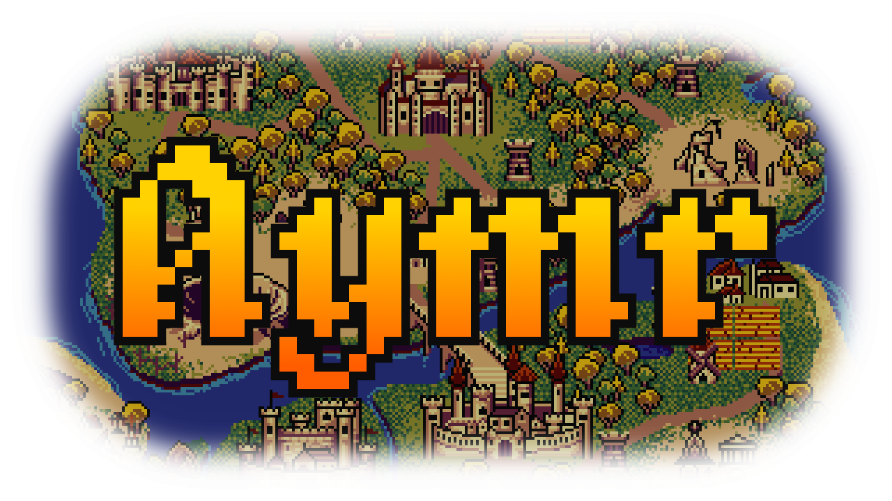
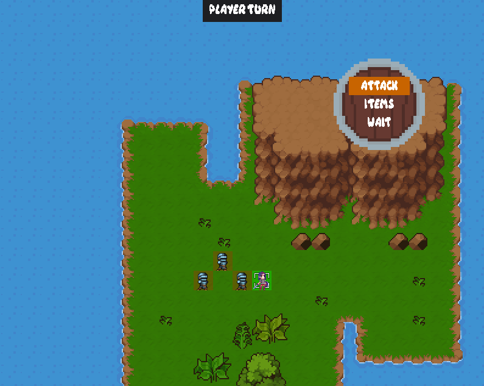
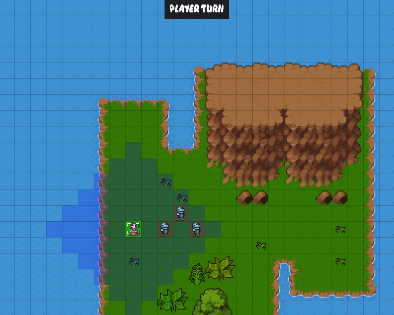
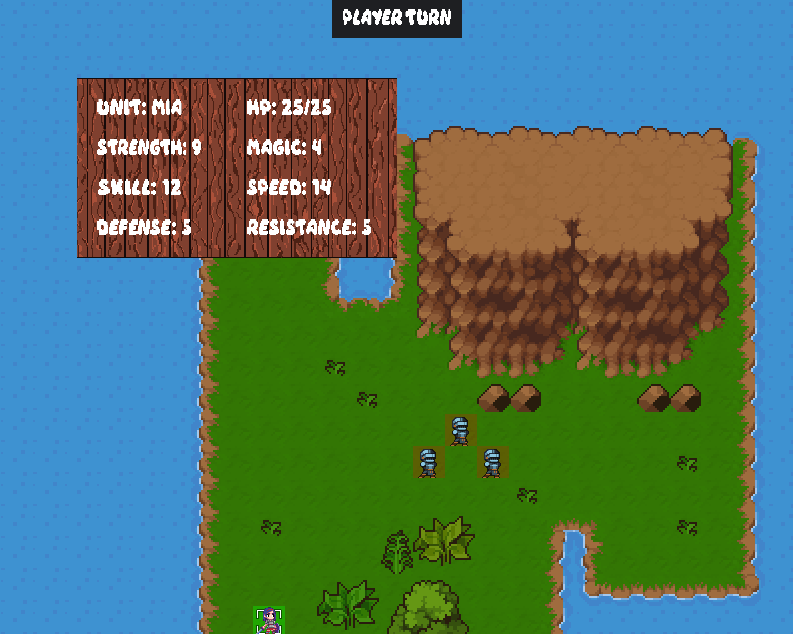
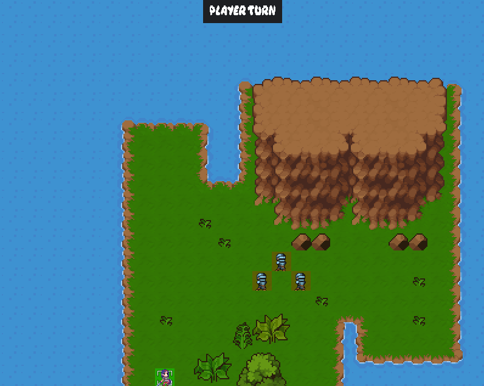
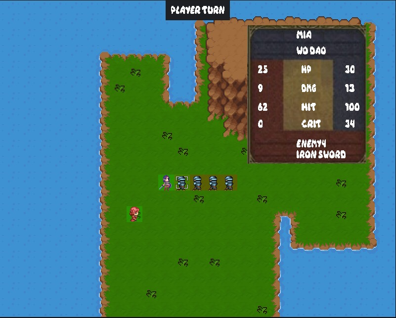
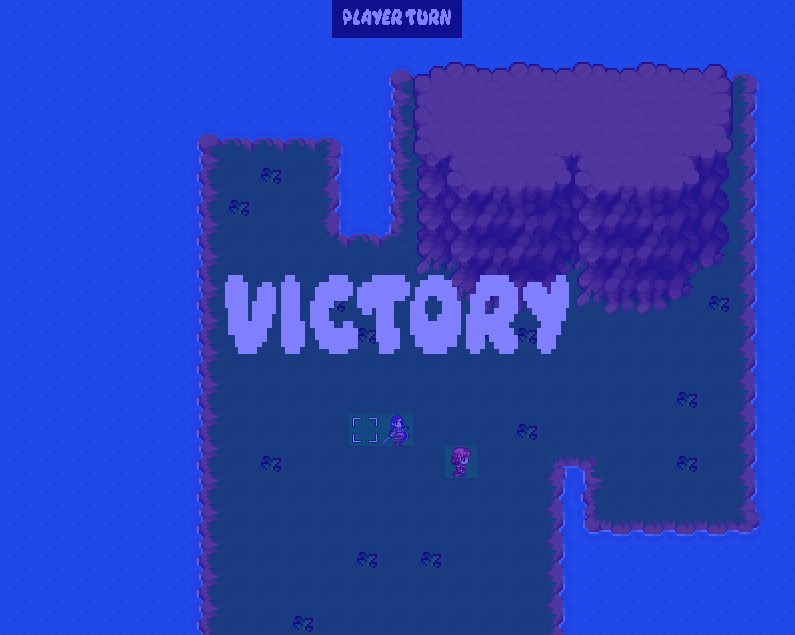

<!-- LOGO -->
<br />
<p align="center">
  <a href="https://github.com/bereis01/DJD_TP/blob/main/README.md">
    
  </a>

  <h3 align="center"><strong>Aymr</strong></h3>
  <p align="center">
    A turn-based casual role-playing game!
    <br />
    <a href="https://github.com/bereis01/DJD_TP/issues">Report Bug</a>
    ·
    <a href="#contact">Send Feedback</a>
  </p>
</p>

<!-- DESCRIPTION -->
# Sobre o Projeto
**Aymr** é um pequeno role-playing game estratégico baseado em turnos, inspirado principalmente por títulos como “Fire Emblem” e “Divinity Original Sin”. O jogo adota uma abordagem mais casual, em que o objetivo é oferecer ao jogador uma experiência curta e prazerosa, com tons de resolução de quebra-cabeças e de imersão em desafios. Incorporando elementos clássicos de RPGs em uma atmosfera de fantasia medieval, diversas mecânicas já bem estabelecidas no gênero são combinadas em uma interação ao estilo one-shot, cuja diversão surge no raciocínio lógico exigido pelas fases, na ambientação construída por cenários e por trilhas sonoras imersivas, e, principalmente, pelas mecânicas simples e que abrem margem para várias possibilidades.

O jogo em si é um RPG estratégico top-down em um universo bidimensional (grid), em que o jogador possui um conjunto de unidades e deve, a cada fase, eliminar todos os oponentes presentes em campo. A progressão é feita em turnos, alternados entre o jogador e a máquina. Em seu turno, o jogador é capaz de movimentar e atacar com cada uma de suas unidades, sendo o mesmo válido para o inimigo. O jogo acaba quando um exército elimina completamente o outro, condição na qual se torna vitorioso. No momento, apenas as mecânicas fundamentais do jogo estão implementadas em uma única fase. Porém, em etapas futuras do desenvolvimento, pretende-se adicionar mais níveis, assim como mecânicas de progressão para as unidades.

A implementação foi feita inteiramente na linguagem de programação C++, com o auxílio da biblioteca "Simple Directmedia Layer" (SDL). Todo o código-fonte está disponível de maneira aberta neste repositório. Todos os assets utilizados, como músicas e sprites, foram extraídos de fontes livres, com destaque para a plataforma <a href="https://itch.io/">Itch.io</a>. Como já mencionado, a ambientação segue uma temática de fantasia medieval, a qual é capturada pelos seus cenários, personagens, inimigos e animações, assumindo perfil artístico simples, com cores contrastantes e animadas, assim como um perfil musical envolvente e imersivo.

Action Menu                |  Unit Movement
:-------------------------:|:-------------------------:
  |  

Stats Menu                 |  Game Field
:-------------------------:|:-------------------------:
  |  

Attack Menu                |  Victory Screen
:-------------------------:|:-------------------------:
  |  

<!-- FUNCTIONALITIES -->
# Funcionalidades
Aymr ainda é um projeto em desenvolvimento. No momento, apenas as mecânicas mais fundamentais estão implementadas. O estado atual do jogo não reflete o produto final e está totalmente sujeito a mudanças. A seguir, tem-se uma lista das principais features existentes e passíveis de serem testadas:

- Troca de turnos entre jogador e inimigo;
- Movimentação das unidades do jogador;
- Ataque das unidades do jogador;
- Movimentação e ataque automáticos das unidades inimigas;
- Condição de vitória/derrota na eliminação completa de um dos exércitos;

<!-- CONTROLS -->
# Controles
- Para a movimentação do cursor, utilize ```W```, ```A```, ```S``` e ```D```;
- A progressão do jogo é feita em turnos. Em seu turno, o jogador pode selecionar sua unidade, movê-la e, em seguida, escolher uma dentre três ações: atacar (botão ```ATTACK```), recuperar 10 de vida da sua unidade (botão ```ITEM```) (no momento, os usos de itens estão limitados a 2) ou não fazer nada (botão ```WAIT```);
- O turno do inimigo é automático. Cada unidade inimiga se movimenta e, caso exista alguma unidade aliada perto o suficiente, realiza um ataque;
- Para confirmar ações, pressione a tecla ```ENTER``` (e.g.: selecionar uma unidade para movê-la, selecionar o destino da movimentação, escolher a ação, etc);
- Antes de confirmar um ataque, uma tela irá aparecer indicando a vida atual de cada unidade, o dano a ser aplicado, a chance de acerto (hit) e a chance de acerto crítico (que multiplica o dano por 3). Para confirmar o ataque, aperte ```ENTER``` novamente e o ataque será realizado, gastando a ação da unidade no turno;
- Pressionar a tecla ```SPACE``` sobre qualquer unidade, aliada ou inimiga, exibirá uma janela com suas informações (vida atual, parâmetros, etc);
- A tecla ```B``` é a tecla de "back": pressioná-la irá retornar o jogo para o estado anterior (e.g.: pressionar ```B``` durante a escolha da ação irá retornar para o estado em que se escolhe o destino da movimentação da unidade);

<!-- MECHANICS -->
# Mecânicas
- A ideia do jogo é ser um RPG tático, então a ação só é confirmada quando o jogador pressionar ```ENTER``` na tela de ataque. Ou seja, é possível analisar os atributos das unidades e o resultado do combate (i.e., qual a chance de acertar e o ataque em caso de acerto) livremente antes de realizar a ação.
- Ainda não foram implementadas as indicações visuais do dano aplicado a cada ataque, então, para ver o resultado do combate, utilize ```SPACE``` na unidade para analisar o seu estado. É mostrado, dentre outras coisas, a vida atual dela.
- Há uma mecânica de contra-ataque. Observa-se que, na tela de ataque, estão escritos, no fundo azul, os parâmetros (dano, acurácia, etc) da unidade do jogador. Já no fundo vermelho, estão escritos os parâmetros do inimigo. De fato, caso o ataque não mate o inimigo, ele irá contra-atacar a unidade do jogador. O mesmo é válido para as unidades do jogador, que podem contra-atacar as unidades inimigas durante o turno do inimigo. Os inimigos do playtest foram implementados com armas corpo a corpo e, portanto, a maga (personagem de cabelo vermelho) pode atacá-los a 2 de distância e não sofrer contra-ataque, pois está atacando à distância. Isso é indicado na tela de ataque por "--" nos parâmetros relativos ao inimigo.

<!-- CONTACT -->
# Contato
Bernardo Reis de Almeida (bera01@ufmg.br)
- Responsável por: movimentação de câmera e de cursor, efeitos de troca de cena, controle automático dos inimigos, instanciação do mapa;

Matheus Farnese Lacerda Senna (matheus.farnese.senna@gmail.com)
- Responsável por: controle (movimentação/ataque) das unidades aliadas, design do mapa, escolha dos sprites, menus e telas de HUD;
