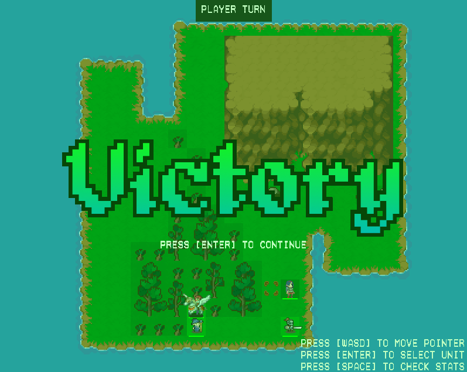

<!-- LOGO -->
<br />
<p align="center">
  <a href="https://github.com/bereis01/DJD_TP/blob/main/README.md">
    
  </a>

  <h3 align="center"><strong>Aymr</strong></h3>
  <p align="center">
    A turn-based casual role-playing game!
    <br />
    <a href="https://github.com/bereis01/DJD_TP/issues">Report Bug</a>
    ·
    <a href="#contact">Send Feedback</a>
  </p>
</p>

<!-- DESCRIPTION -->
# Sobre o Projeto
**Aymr** é um pequeno role-playing game estratégico baseado em turnos, inspirado principalmente por títulos como “Fire Emblem” e “Divinity Original Sin”. O jogo adota uma abordagem mais casual, em que o objetivo é oferecer ao jogador uma experiência curta e prazerosa, com tons de resolução de quebra-cabeças e de imersão em desafios. Incorporando elementos clássicos de RPGs em uma atmosfera de fantasia medieval, diversas mecânicas já bem estabelecidas no gênero são combinadas em uma interação ao estilo one-shot, cuja diversão surge no raciocínio lógico exigido pelas fases, na ambientação construída por cenários e por trilhas sonoras imersivas, e, principalmente, pelas mecânicas simples e que abrem margem para várias possibilidades.

O jogo em si é um RPG estratégico top-down em um universo bidimensional (grid), em que o jogador possui um conjunto de unidades e deve, a cada fase, eliminar todos os oponentes presentes em campo. A progressão é feita em turnos, alternados entre o jogador e a máquina. Em seu turno, o jogador é capaz de movimentar e atacar com cada uma de suas unidades, sendo o mesmo válido para o inimigo. O jogo acaba quando um exército elimina completamente o outro, condição na qual se torna vitorioso. No total, duas diferentes fases estão disponíveis para o entretenimento do jogador.

A implementação foi feita inteiramente na linguagem de programação C++, com o auxílio da biblioteca "Simple Directmedia Layer" (SDL). Todo o código-fonte está disponível de maneira aberta neste repositório. A maioria dos assets utilizados, como músicas e sprites, foram extraídos de fontes livres, com destaque para a plataforma <a href="https://itch.io/">Itch.io</a>. Alguns assets foram feitos manualmente com o auxílio de editores gráficos. Como já mencionado, a ambientação segue uma temática de fantasia medieval, a qual é capturada pelos seus cenários, personagens, inimigos e animações, assumindo um perfil artístico simples, com cores contrastantes e animadas, assim como tons musicais envolventes e imersivos.

Main Menu                  |  Ending Scene
:-------------------------:|:-------------------------:
  |  

Level 1                    |  Level 2
:-------------------------:|:-------------------------:
  |  

Unit Movement              |  Stats Screen
:-------------------------:|:-------------------------:
  |  

Items Screen               |  Attack Screen
:-------------------------:|:-------------------------:
  |  

Victory                    |  Defeat
:-------------------------:|:-------------------------:
  |  

<!-- FUNCTIONALITIES -->
# Funcionalidades
A seguir, tem-se uma lista das principais features disponíveis no jogo.

- Troca de turnos entre jogador e inimigo;
- Movimentação, ataque e uso de itens (armas e poções) por parte das unidades do jogador;
- Sistema de armas e de atributos para alterar a dinâmica de batalha do jogador;
- Interface de loja e de atualização de atributos;
- Controle automático das unidades do inimigo, incluindo ataque e uso de itens;
- Esquemas de movimentação únicos entre unidades inimigas, incluindo abordagens reativas;
- Condição de vitória/derrota na eliminação completa de um dos exércitos;
- Um total de duas fases, incluindo uma tela inicial antes e uma tela de finalização depois;

<!-- CONTROLS -->
# Controles
A maioria dos controles é indicada em suas respectivas telas de interface dentro do jogo. Porém, aqui, há um resumo das principais funcionalidades implementadas.

- Para controle nas telas de menu, loja e upgrade, utilize ```W```, ```A```, ```S``` e ```D``` para escolher opções e ```ENTER``` para as selecionar;
- Para a movimentação do cursor dentro do jogo, utilize ```W```, ```A```, ```S``` e ```D```. Para confirmar ações, pressione a tecla ```ENTER``` (e.g.: selecionar uma unidade para movê-la, selecionar o destino da movimentação, escolher a ação, etc);
- A progressão do jogo é feita em turnos. Em seu turno, o jogador pode selecionar cada unidade, movê-la e, em seguida, escolher uma dentre três ações: atacar (botão ```ATTACK```), utilizar algum item (botão ```ITEM```) ou não fazer nada (botão ```WAIT```);
- O turno do inimigo é automático. Cada unidade inimiga se movimenta e, caso exista alguma unidade aliada perto o suficiente, realiza um ataque. Também há uma pequena chance de utilizarem um item de cura;
- Antes de confirmar um ataque, uma tela irá aparecer indicando a vida atual de cada unidade, o dano a ser aplicado, a chance de acerto e a chance de acerto crítico. Para confirmar o ataque, aperte ```ENTER``` novamente e o ataque será realizado, gastando a ação da unidade no turno. É possível escolher entre diferentes armas para se atacar usando as teclas ```A``` e ```D```;
- Pressionar a tecla ```SPACE``` sobre qualquer unidade, aliada ou inimiga, exibirá uma janela com seus atributos (e.g. vida atual, agilidade, defesa);
- A tecla ```B``` é a tecla de "back": pressioná-la irá retornar o jogo para o estado anterior (e.g.: pressionar ```B``` durante a escolha da ação irá retornar para o estado em que se escolhe o destino da movimentação da unidade);

<!-- MECHANICS -->
# Mecânicas
Algumas das principais mecânicas do jogo são pontuadas a seguir.

- A ideia do jogo é ser um RPG tático, então a ação só é confirmada quando o jogador pressionar ```ENTER``` na tela de ataque. Ou seja, é possível analisar os atributos das unidades e o resultado do combate (e.g. qual a chance de acertar e o dano resultante em caso de acerto) livremente antes de realizar a ação;
- Há uma mecânica de contra-ataque. Observa-se que, na tela de ataque, estão escritos, no fundo escuro, os atributos (dano, acurácia, etc.) da unidade do jogador. Já no fundo vermelho, estão escritos os atributos do inimigo. Caso um ataque não mate a unidade-alvo, esta irá contra-atacar o seu atacante caso este esteja em seu alcance;
- Diferentes unidades aliadas podem utilizar diferentes armas com diferentes atributos. É possível alterar esses elementos nas interfaces de loja e de upgrade. Experimente várias combinações para conseguir derrotar todos os inimigos das fases!

<!-- CONTACT -->
# Contato
Bernardo Reis de Almeida (bera01@ufmg.br)
- Responsável por: movimentação da câmera e do cursor, lógica de troca de cenas e de turnos, telas de menu e de finalização, sprites, animações e efeitos sonoros, controle automático de inimigos;

Matheus Farnese Lacerda Senna (matheus.farnese.senna@gmail.com)
- Responsável por: design das fases, unidades aliadas, ações e movimentação, toda a infraestrutura de itens, atributos, incluindo a loja e a tela de upgrade, balanceamento do jogo;
